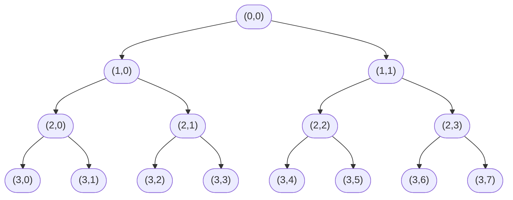

# merkle-tree

## Background

```mermaid
flowchart TD
    0(["(0,0)"])
    1(["(1,0)"])
    2(["(1,1)"])
    3(["(2,0)"])
    4(["(2,1)"])
    5(["(2,2)"])
    6(["(2,3)"])
    7(["(3,0)"])
    8(["(3,1)"])
    9(["(3,2)"])
    10(["(3,3)"])
    11(["(3,4)"])
    12(["(3,5)"])
    13(["(3,6)"])
    14(["(3,7)"])
    0 --> 1
    0 --> 2
    1 --> 3
    1 --> 4
    2 --> 5
    2 --> 6
    3 --> 7
    3 --> 8
    4 --> 9
    4 --> 10
    5 --> 11
    5 --> 12
    6 --> 13
    6 --> 14
```